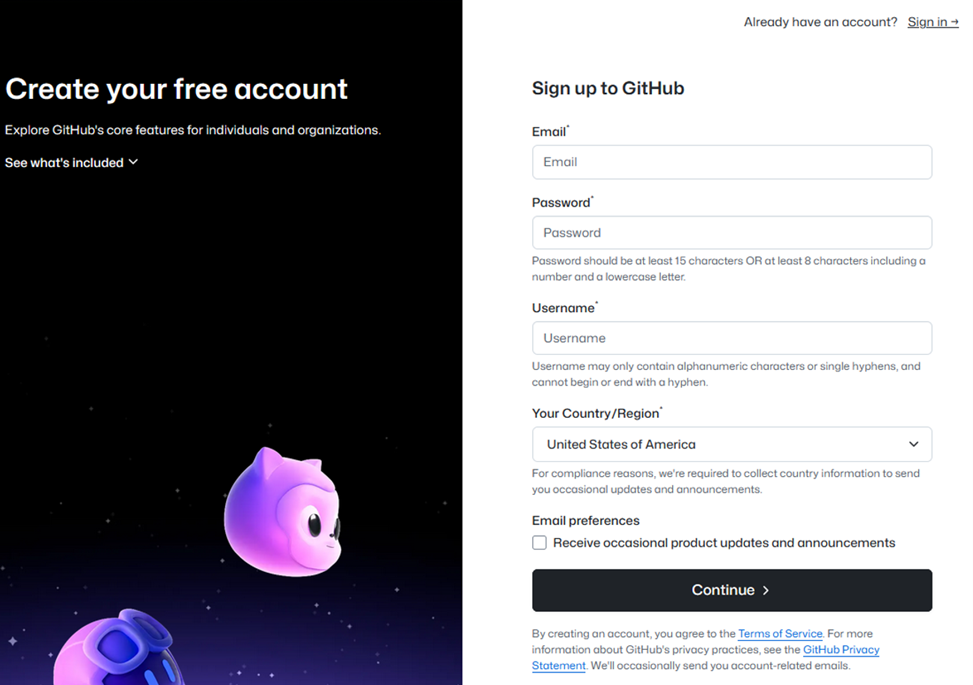
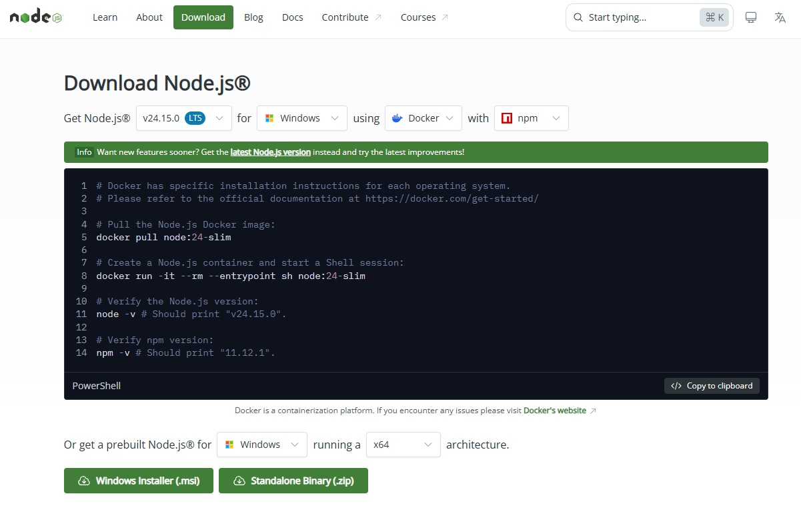

# Learn GitHub actions in 4 hours

Repository with associated lab files from the Learn GitHub Actions in 4 hours live lesson
  
## 📥 Getting Started & Prerequisites

1. Sign up for a GitHub account (in case you don’t already have one) at:  
   [https://github.com/signup](https://github.com/signup) 
   
   

2. Make sure you have NPM installed in your system, if you don’t have it installed follow the documentation in the following link:  
   [https://nodejs.org/en/download/](https://nodejs.org/en/download/) 
   
   

## 🧪 Labs

[Lab 1: GitHub Overview](./lab1.md)

[Lab 2: Setup a runner and a workflow](./lab2.md)

[Lab 3: Advanced workflow](./lab3.md)

[Lab 4: Building & testing](./lab4.md)

[Lab 5: Deploy](./lab5.md)