**Exercise \#2: Setup a runner and a workflow**

1)  Go back to the repository we created in the previous exercise and
    click on the “settings” tab. Then within the “Code and automation”
    section from the left menu, click on “Actions” \> “runners” and then
    click on the green “New self-hosted runner” button at the top
    right.:

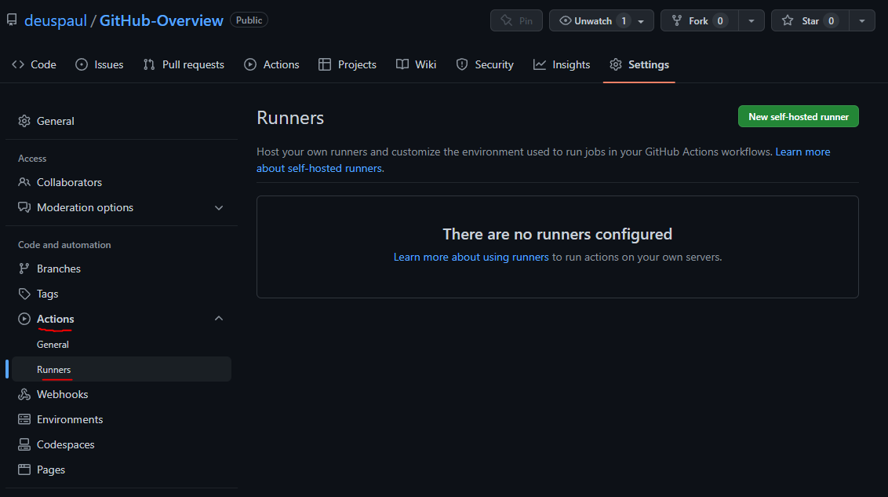

2)  Select your Operating System in “Runner image” and your architecture
    (x64/arm)

3)  Follow the steps listed below architecture to download and install
    the runner (Hint: you can copy the commands by clicking on them)

4)  Example for Windows:\
    Open Terminal or Cmd/Powershell **<span class="mark">as
    administrator</span>** and create a folder called “actions-runner”
    in the drive root and open that directory:\
    \
    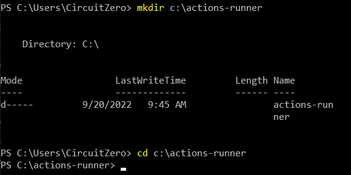

5)  Download the latest runner package:

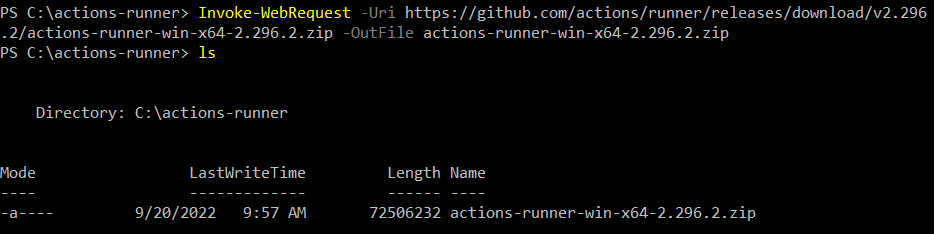

6)  Check the integrity of the downloaded file to make sure its
    legitimate (if it has been compromised it will display the message
    saying “Computed checksum did not match”):\
    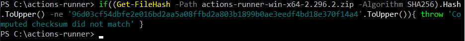

7)  Extract the file contents to the current location:\
    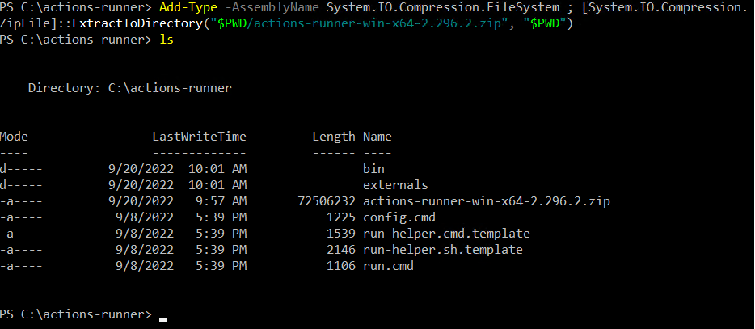

8)  Register the runner to your github repository with the first command
    in the “Configure” section. You can leave the default values for
    name, labels and work folder or change them\
    when prompted if you would like to run it as a service select “y”,
    and select the default account to use for the service (NT
    Authority\Network service):\
    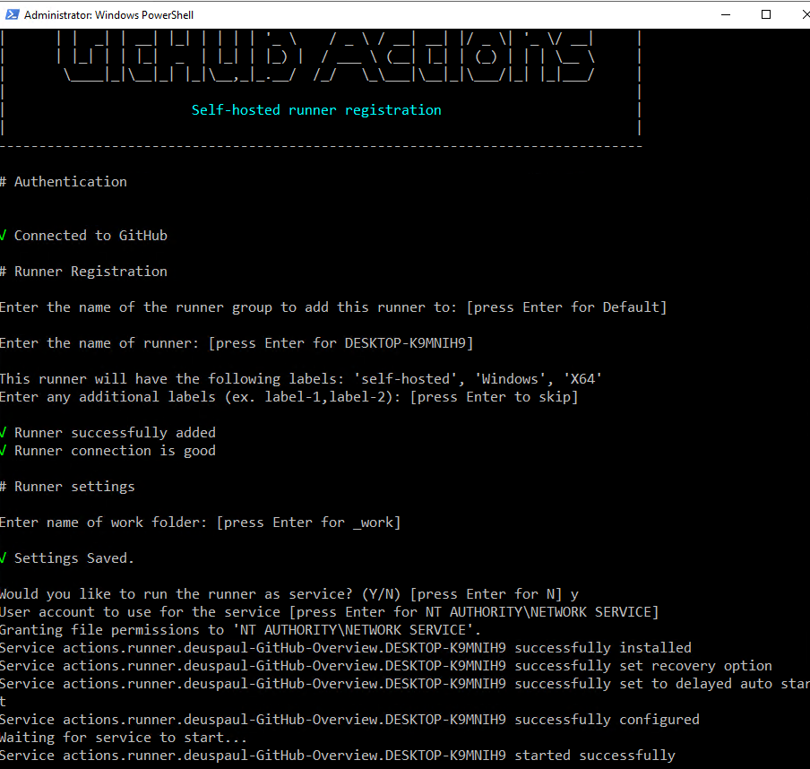

9)  Once you have completed the previous step, your runner should appear
    as online/idle within the repository “settings \> actions \>
    runners”\
    \
    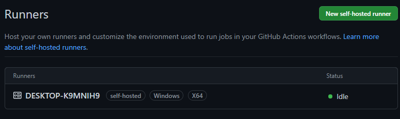

10) If it appears as offline, you may need to run the “./run.cmd”
    command\
    \
    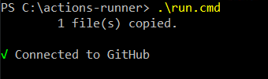

11) Now we are ready to test our runner. Click on “Code”, then on the
    “Add file” button and select “Create new file”\
    \
    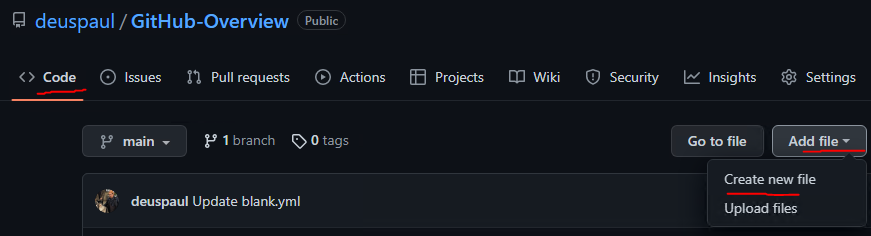

12) At the top part, type “.github/”, then “workflows/”, and then
    “firstWorkFlow.yml”:\
    \
    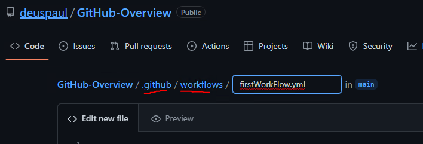

Add the following code to the file, mind the 2 spaces between each
indent.\
Note: if you set up a self-hosted Linux/macOS runner in the previous
step, you need to <span class="mark">change</span> line 11 (shell: cmd)
to (<span class="mark">shell: bash</span>):\
\
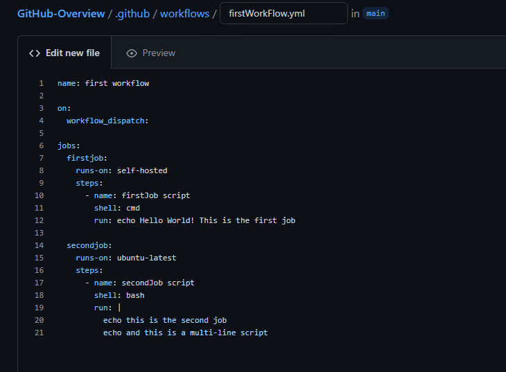
 
```yaml
name: first workflow

on:
  workflow_dispatch:

jobs:
  firstjob:
    runs-on: self-hosted
    steps:
      - name: firstJob script
        shell: cmd
        run: echo Hello World! This is the first job

  secondjob:
    runs-on: ubuntu-latest
    steps:
      - name: secondJob script
        shell: bash
        run: |
          echo this is the second job
          echo and this is a multi-line script
```


13) Click on the green “Commit changes..” button on the right side,
    leave “Commit directly to the main branch” selected and next click
    on the green “Commit changes” button.\
    \
    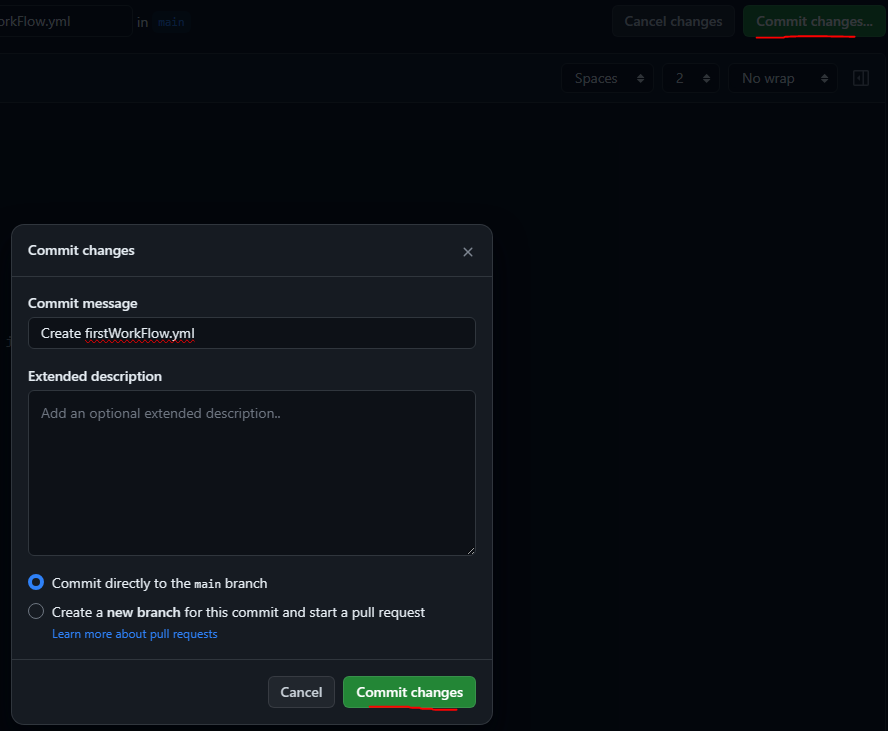

14) Click on “Actions”, you should see your workflow listed there:\
    \
    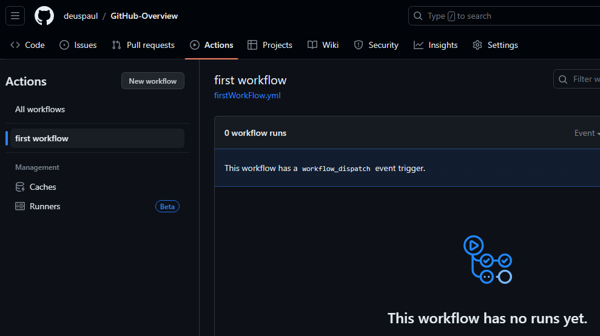

15) Next, select your workflow and click on “run workflow”, select
    “main” branch, and click on “run workflow”\
    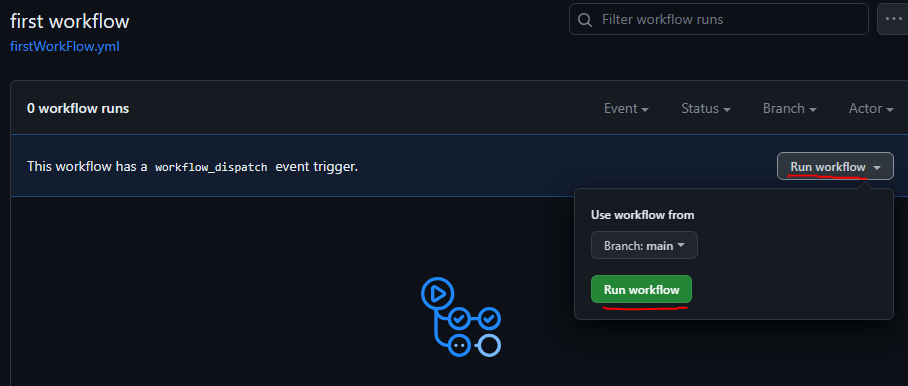

16) After a couple of seconds, the job will be launched, and you can see
    its details by clicking on it:\
    \
    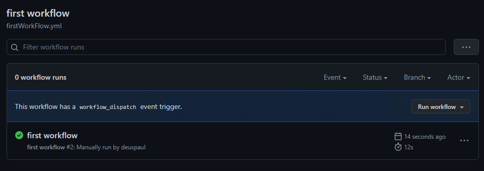

17) Here you can see it is a workflow made up of 2 jobs\
    \
    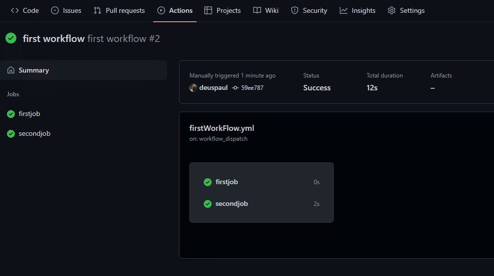

18) Upon clicking on each job, you can see the steps within:\
    \
    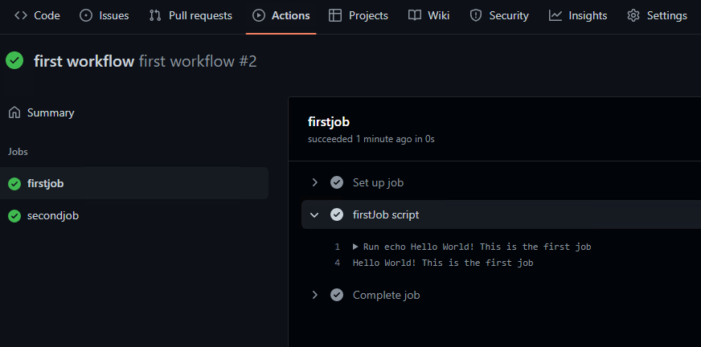\
    \
    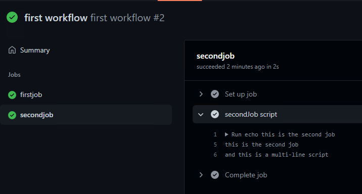

19) Now lets go ahead and remove the self-hosted runner.\
    This is especially important if your repository is public as this
    could allow others to execute code from forks of your repository.\
    Click on “settings”, “actions” \> “runners” and click on your
    runner\
    \
    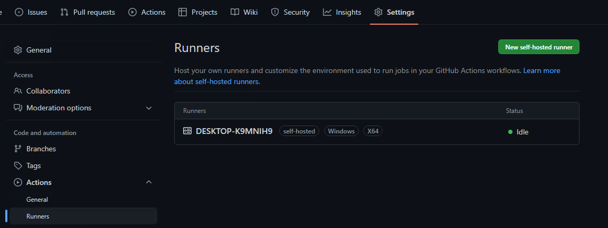

20) Click on the remove button, that should show the following pop-up.
    Ideally you should remove the runner with the command shown in the
    pop-up (change “config.sh” to “config.cmd” in case of windows), or
    you can

Also click on the “force remove this runner button”\
\
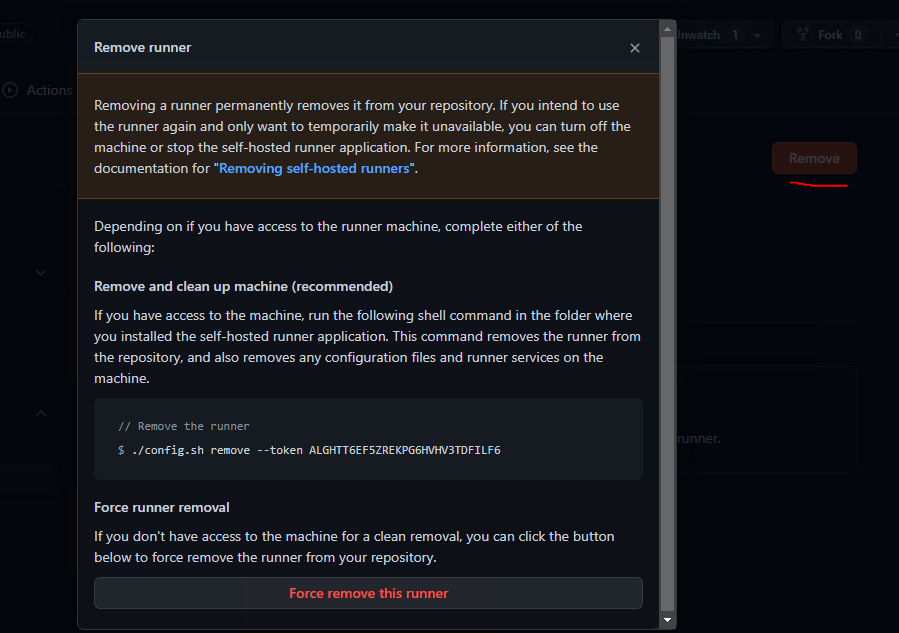\
\
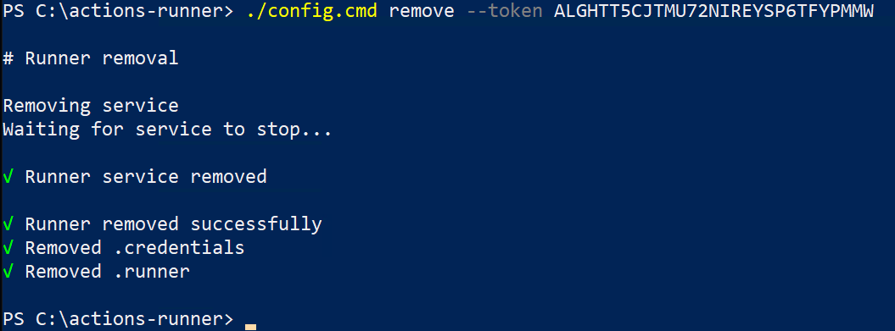