**Exercise \#3: Advanced workflow**

1)  For this exercise, let’s create a new repository, let’s name it
    “exercise3”, then select “Public” and check the “Add a README file”
    checkbox so that your repository can be initialized with a “README”
    file.\
    \
    In another tab, open the previous repository and access the
    “.github” and “workflows” directories and click on the workflow
    “firstWorkflow.yml”. Next, click on the “copy” icon (2 squares) to
    the right to copy the code from the workflow file:\
    \
    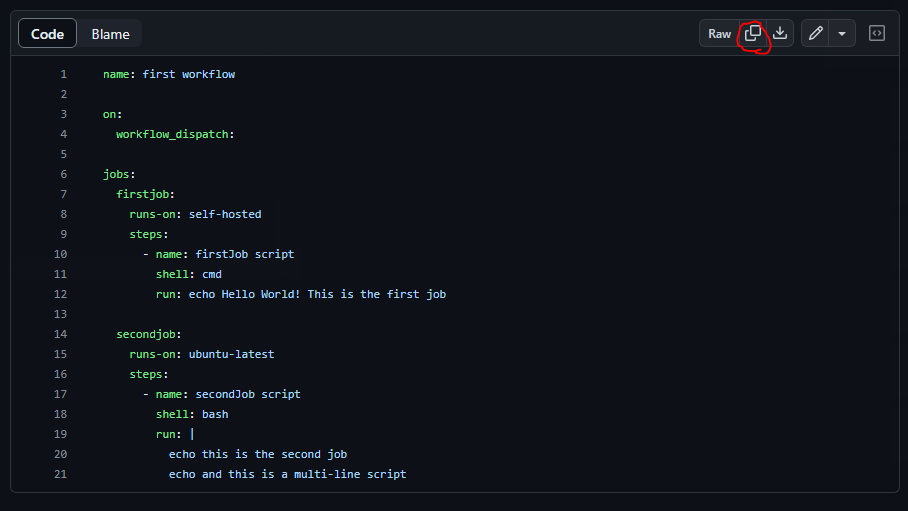

2)  In the new repository (exercise3), click on “add a new file” \>
    “create a new file” and add “.github/workflows/” so these
    directories get created and name the file: “advancedWorkflow.yml”.\
    Then paste the code from the previous repository and change the
    runner for the first job from “self-hosted” to “ubuntu-latest” along
    with the shell of the job from “cmd” to “bash”.

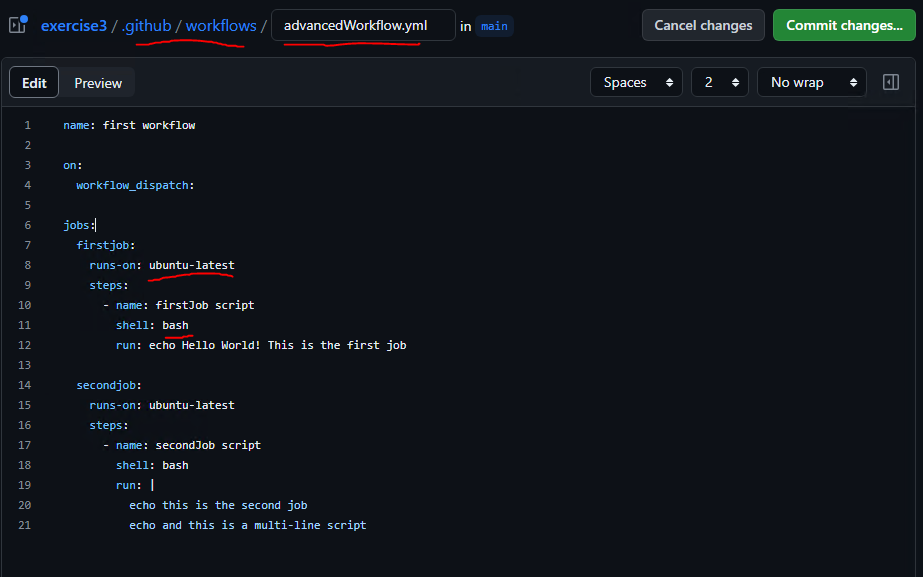

3)  Next, we will add some GitHub actions to it. On the right side you
    will notice that there is a list of several GitHub actions from the
    marketplace (If they don’t appear, click on the “collapse help
    panel” button to the right of the selectbox with the “No wrap”
    label).\
    Search “checkout” and locate an action by “actions” with the blue
    checkmark indicating a verified creator and click on it:\
    \
    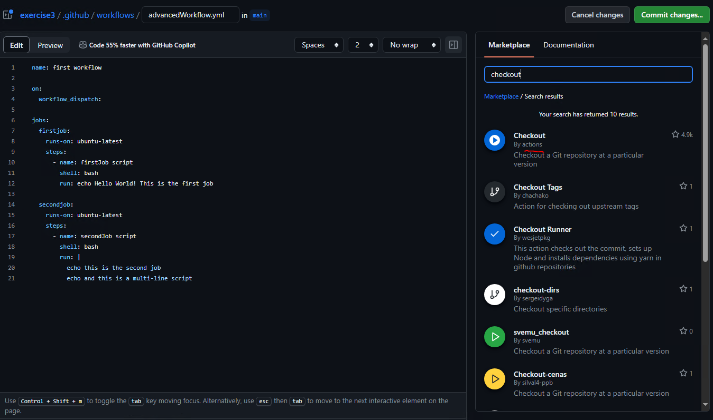

4)  It will display its usage instructions, though it’s a little bit
    crowded for that window, so go ahead and click on the “view full
    Marketplace listing” link instead.

5)  In the full marketplace listing page, it shows you the description
    for the selected version, the new features for this version as well
    as the usage and some example scenarios. If you would like to change
    to a previous version, you can do so by clicking on the green button
    at the top right labeled “Use latest version”.\
    \
    This is one of the most used functions as it clones your GitHub
    repository to the runner so you can work with your code\
    \
    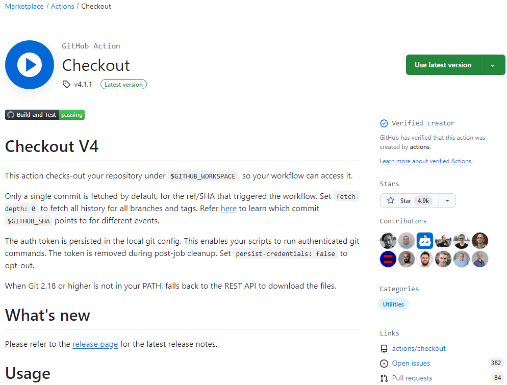

6)  Go back to the tab where we are editing the code of your workflow
    and add this action to a step\
    \
    - name: checkout\
    uses: actions/checkout@v4\
    \
    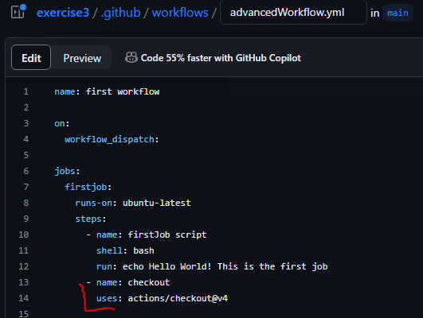

7)  Next, lets add another action that we can interact with, this time
    we will use an action from a repository instead of an action from
    the marketplace. In another tab open <https://github.com/actions>,
    and in the repositories search bar, type “hello”, and click on the
    “hello-world-javascript-action”\
    \
    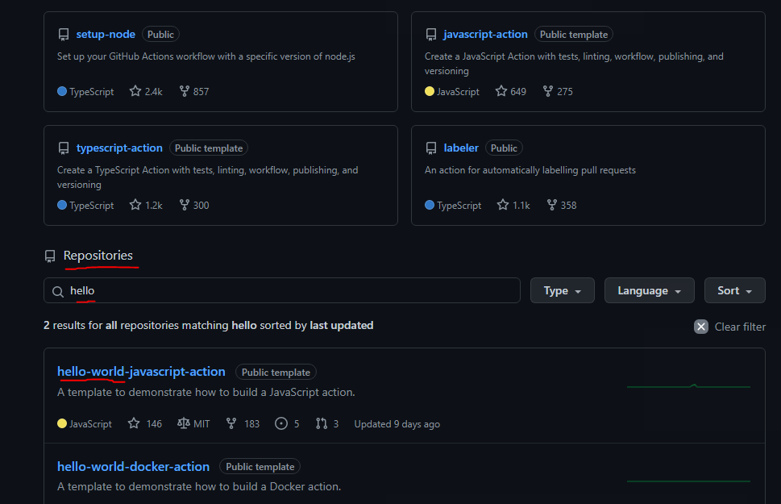

8)  At the bottom of the repository, you will find the instructions to
    use this action under the “Usage” section. Make note of the output
    section as well, this means that this action has an output, which in
    this case is the time in which the action ran:\
    \
    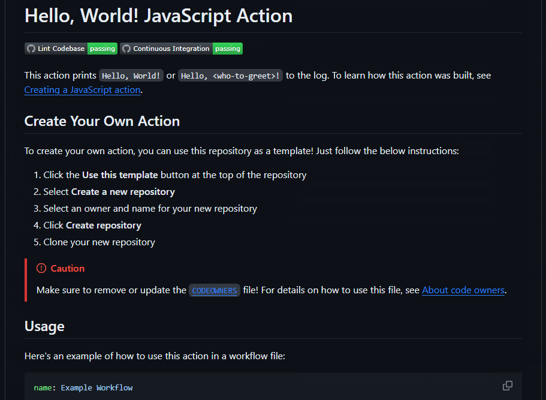

9)  Select the code from the “Print to Log” step and copy it.\
    \
    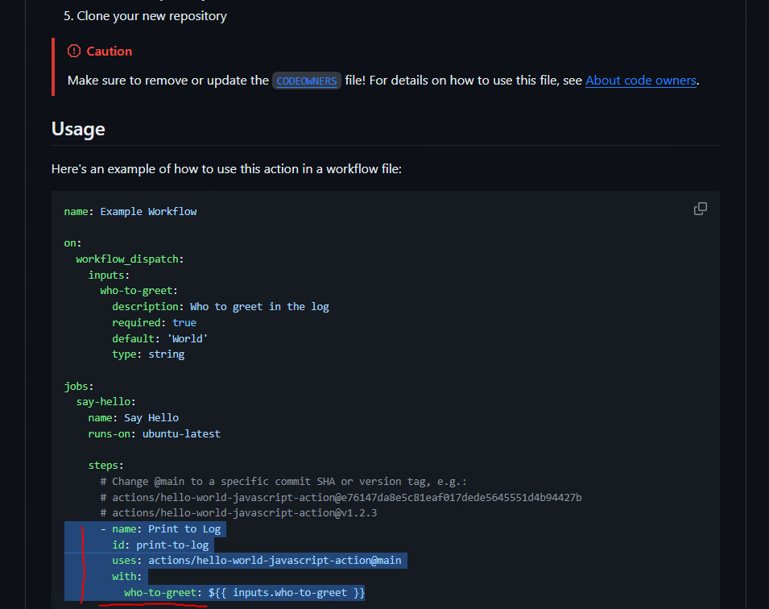\
    \
    Then paste it in our “advancedWorkflow.yml” file right after the
    previous step with the “checkout action”.\
    Replace “\${{ inputs.who-to-greet }}” with \${{ github.actor }}”\
    \
    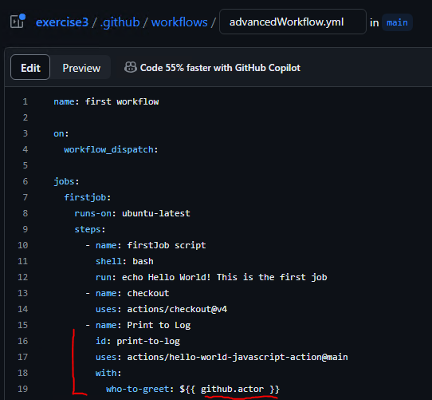

10) Create another step with the name “time” and add run with the
    following code:

\- name: time\
run: \|\
echo "The time of the greeting was at: \${{
steps.print-to-log.outputs.time }}"\
\
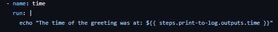

11) Go ahead and click on the green “Commit changes” button at the top
    right, then add a message and description and click on commit
    changes (leave “commit directly to main branch selected)\
    \
    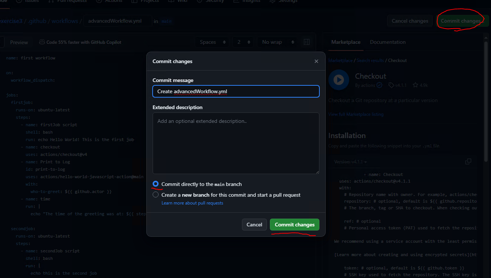

12) Click on the actions tab, select your workflow and click on the “run
    workflow” button (remember we have set it up to work this way with
    the “workflow_dispatch” trigger\
    \
    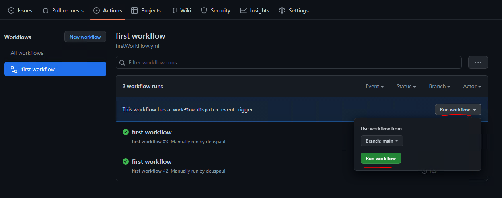

13) Click on the first job, there you should see our 3 new steps,
    “checkout” which basically initializes a git repository in the
    runner, links our GitHub repository with the git remote add command
    and then fetches the contents, though we do not have anything in our
    repository right now.\
    Then in the “print-to-log” step, it basically outputs Hello followed
    by the value of the “github.actor” variable (which is the GitHub
    user)\
    And in the “time” step just outputs our message followed by the
    time\
    \
    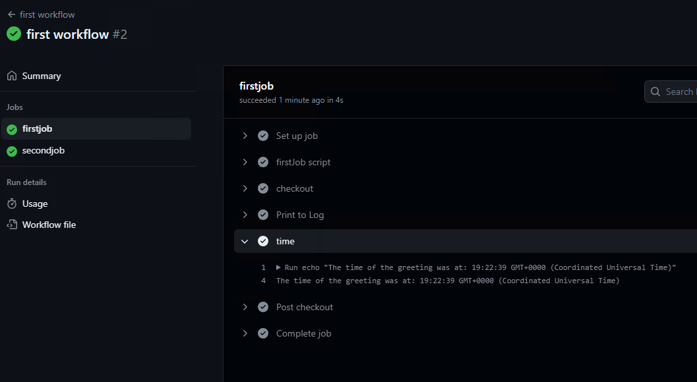

14) Now let’s go back to our editor to keep working on our workflow. The
    first thing we are going to do is make job2 wait for job1 to finish
    in order to serialize them instead of having them run in parallel.
    This is done with the “needs” keyword, so add the following code
    right after the “runs-on: ubuntu-latest” line:\
    \
    needs: firstjob\
    \
    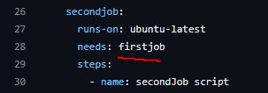

15) Next we will learn how to use variables. The highest level for
    variables is at the workflow level, this variable will be available
    to all the jobs and steps, so add the following code right after the
    line of code where we name our workflow:\
    \
    env:\
    WORKFLOW_VAR: "This variable is declared at the workflow level"\
    \
    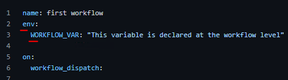

16) Next, lets add a variable at the job level, so in the “secondjob”
    add the following block of code after the line of code with the
    “needs” keyword\
    \
    env:\
    JOB_VAR: " This is a job variable"\
    \
    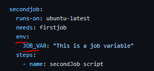

17) And last, the variable at the step level, so lets go ahead and
    create a new step with name “environment variables”\
    next add “env:” and the step variable “STEP_VAR” with the following
    code:\
    \
    - name: environment variables\
    env:\
    STEP_VAR: "This variable is declared at the step level"\
    \
    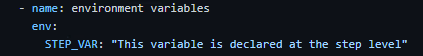

18) Next lets add a secret to our repository. Right click on “Settings”
    and open it in a new tab. Locate the “Security” section in the left
    menu, click on “Secrets and variables” and then on “Actions”. From
    there click on “New repository secret”

19) 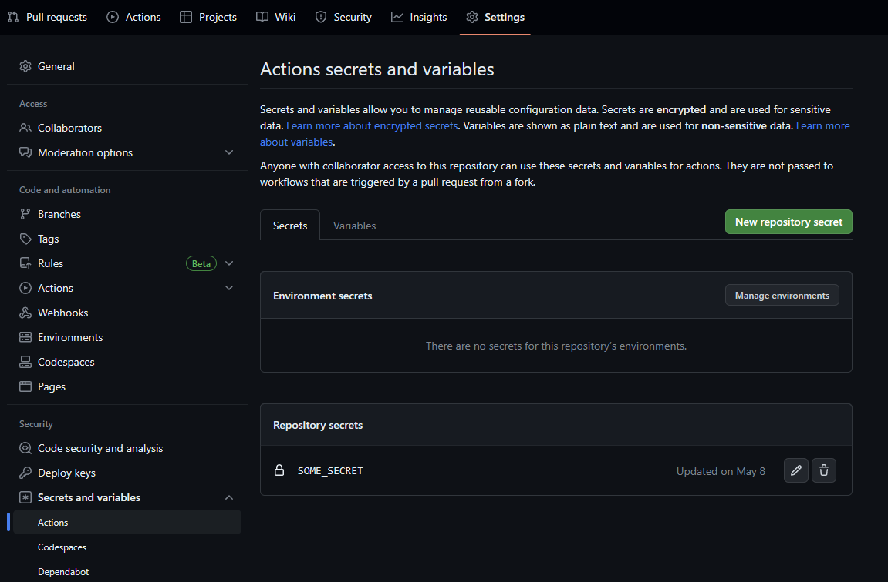

20) Name it “SOME_SECRET” and in the value of the secret field, input
    “password”, and click on “add secret”

21) Go back to the tab where we are editing our workflow, and lets echo
    all our variables in the step we created in the previous step. Add
    the following code:\
    \
    run: \|\
    echo \$WORKFLOW_VAR\
    echo \$JOB_VAR\
    echo \$STEP_VAR\
    echo "The following is a secret: \${{ secrets.SOME_SECRET }}, of
    course, I cant tell you because then it wouldnt be a secret..."\
    echo "The following are default environment variables:"\
    echo \$GITHUB_ACTOR\
    echo \$GITHUB_JOB\
    echo \$GITHUB_REF\
    \
    The code for the second job should look as follows:\
    \
    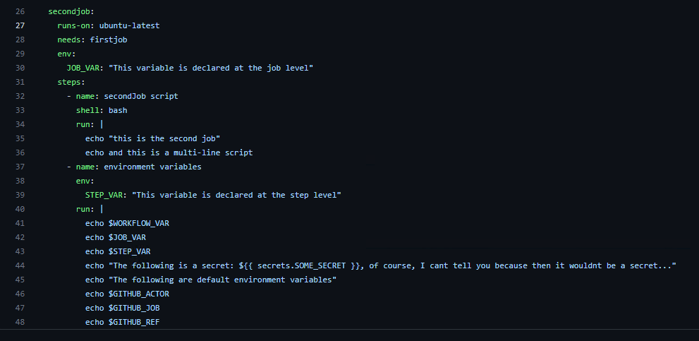

22) Next, commit the changes and launch the workflow.\
    You will notice that the second job comes after the first job now,
    and the output of the variables will be the following:\
    \
    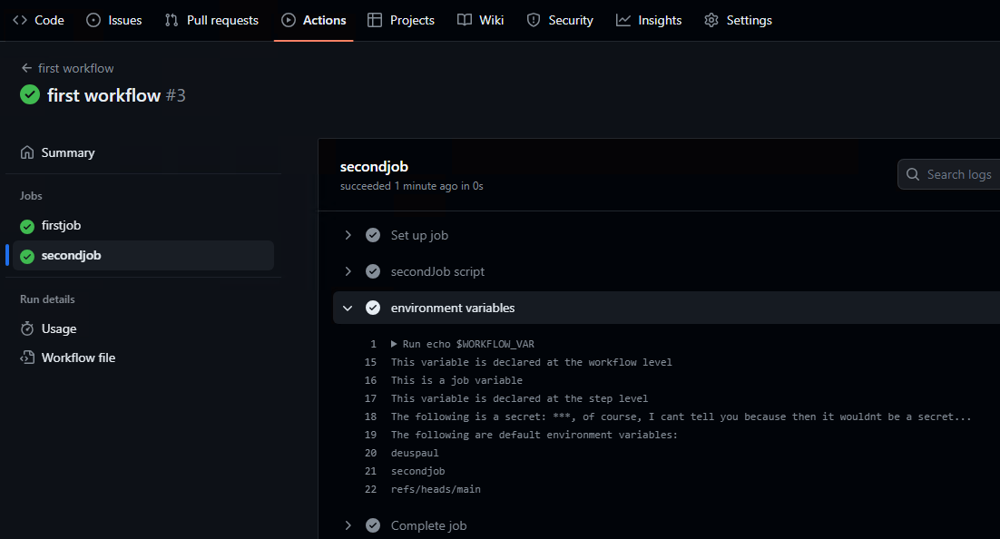