**Exercise \#1: GitHub Overview** 

1)  Open “github.com” in a browser and click on “sign up” to create a
    new account or “sign in” if you already have an account.

2)  Once you are logged in, it will take you to the main page where you
    will see your recent repositories to the left, and a feed with
    activity depending on the repositories that you follow. On the right
    you will see some GitHub adds and updates.

3)  On the top part you have a search bar, a menu with a link to pull
    requests, Issues, Marketplace and Explore. The Marketplace is one of
    the links we will be using in this course, as that is where we will
    find some GitHub Actions that we can integrate into our projects.

4)  At the top right you have notifications, a “+” button to create a
    new repository where you can host your code to collaborate with
    others, a gist which is basically just a snippet of code that you
    can share, an organization in case you want to set up a GitHub
    account for your team, or a project which allows you to plan and
    track work\
    \
    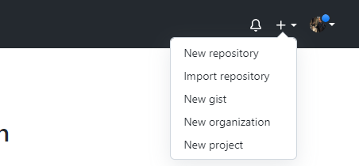

5)  Select “New repository”, in “Repository Name” input “GitHub
    Overview” and select “Private”, then check
    the “Add a README file” checkbox so that your repository can be
    initialized with this “README” file. Leave all other settings with
    their default value and click on “Create repository”

6)  Once your repository has been created, you will be taken to your
    repository:\
    \
    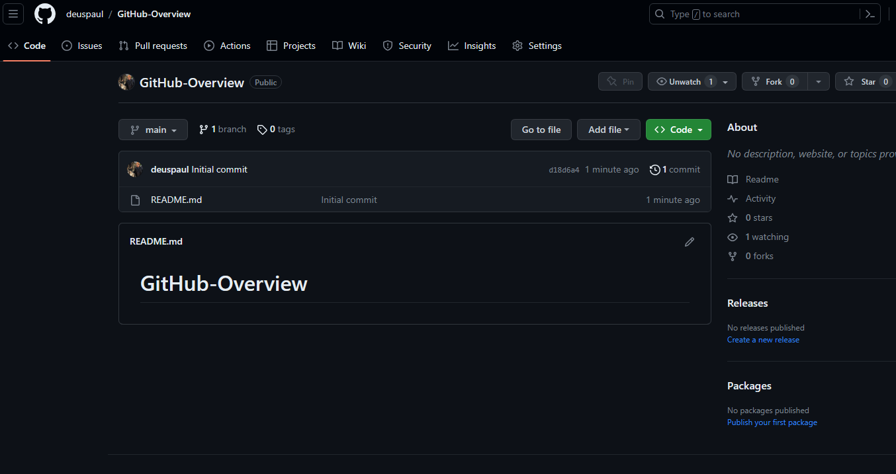

7)  At the top left you will see the “namespace” / “repository name”,
    its visibility (Private\
    ) and to the right the buttons to watch/fork and star. Watch is used
    to customize notifications for this repositors, fork is used to
    create a copy of this repository that you can freely make changes to
    as well as to push back into the parent repository where it was
    forked from, and star is used to add the repository to favorites.

8)  Next, we have a menu that contains a link to the code (code button),
    which is the main page of the repository. Here you will see
    everything related to the files of the repository, along with the
    branches, tags, a button (Add file) to create/upload a file, as well
    as a green button (\<\> Code) with the links to clone the repository
    with ssh, https, download, etc..

9)  Next, we have a button that takes you to a list of issues (issues
    button), followed by one that takes you to the pull requests.
    Actions which is what we will use the most in this lab. Projects, to
    set up project tracking tools such as boards, wiki, to save
    documentation or information about the project. Security, which we
    will also use to set up code-scanning and dependabot, insights,
    which provides details about issues and pull requests. Finally,
    settings, which we will also use several times in the other labs of
    this lesson.

10) Click on “Actions”, since we have not set up a workflow, it will
    show GitHub actions that we can integrate into our repository. If
    you click on the “configure” button within the suggested “simple
    workflow”, it will help you set up a workflow in an editor.\
    \
    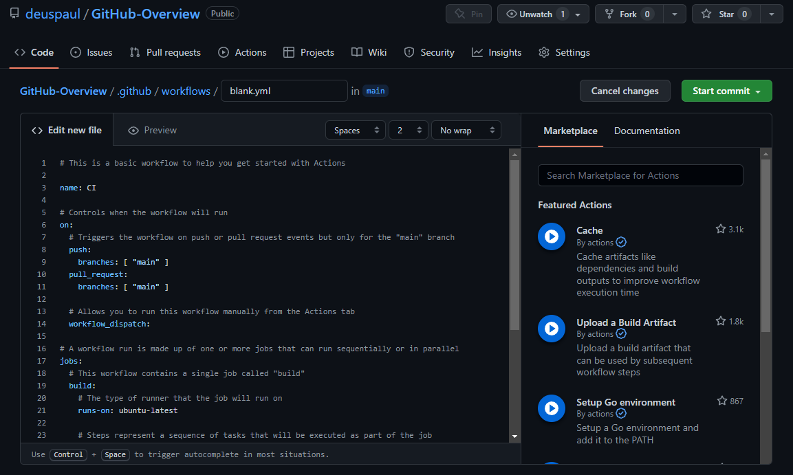

11) To the right, you will notice some action from the Marketplace that
    you can integrate into your workflow. Upon clicking on them, you
    should be able to see the instructions about their usage.\
    \
    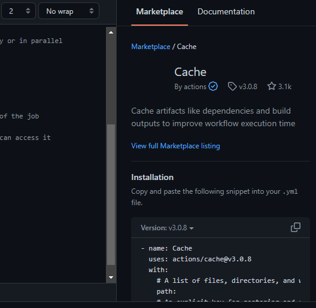

12) For now, its not necessary to click on the green “commit changes”
    button, as this was just an overview.

13) Another place where you can locate GitHub actions is directly in the
    marketplace. To access it, click on the “Marketplace” link below the
    “Featured categories” section at the bottom of the Marketplace tab
    or by clicking on the menu button at the top left to expand the left
    sidebar, and click on Marketplace at the bottom of this menu. In the
    Marketplace you can filter the results by clicking on Types \>
    Actions

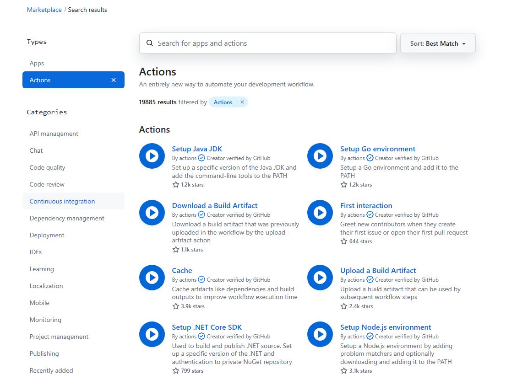

14) Upon clicking on one of the actions, you will be taken to
    information page about this action, which provides you with
    instructions on how it can be used along with different versions of
    the GitHub action: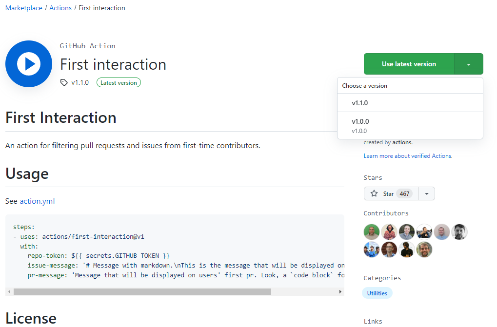

**Exercise \#2: Setup a runner and a workflow**

1)  Go back to the repository we created in the previous exercise and
    click on the “settings” tab. Then within the “Code and automation”
    section from the left menu, click on “Actions” \> “runners” and then
    click on the green “New self-hosted runner” button at the top
    right.:

2)  Select your Operating System in “Runner image” and your architecture
    (x64/arm)

3)  Follow the steps listed below architecture to download and install
    the runner (Hint: you can copy the commands by clicking on them)

4)  Example for Windows:\
    Open Terminal or Cmd/Powershell **as
    administrator** and create a folder called “actions-runner”
    in the drive root and open that directory:\
    \
    

5)  Download the latest runner package:

6)  Check the integrity of the downloaded file to make sure its
    legitimate (if it has been compromised it will display the message
    saying “Computed checksum did not match”):\
    

7)  Extract the file contents to the current location:\
    

8)  Register the runner to your github repository with the first command
    in the “Configure” section. You can leave the default values for
    name, labels and work folder or change them\
    when prompted if you would like to run it as a service select “y”,
    and select the default account to use for the service (NT
    Authority\Network service):\
    

9)  Once you have completed the previous step, your runner should appear
    as online/idle within the repository “settings \> actions \>
    runners”\
    \
    

10) If it appears as offline, you may need to run the “./run.cmd”
    command\
    \
    

11) Now we are ready to test our runner. Click on “Code”, then on the
    “Add file” button and select “Create new file”\
    \
    

12) At the top part, type “.github/”, then “workflows/”, and then
    “firstWorkFlow.yml”:\
    \
    

Add the following code to the file, mind the 2 spaces between each
indent.\
Note: if you set up a self-hosted Linux/macOS runner in the previous
step, you need to change line 11 (shell: cmd)
to (shell: bash):\
\

name: first workflow

on:

workflow_dispatch:

jobs:

firstjob:

runs-on: self-hosted

steps:

\- name: firstJob script

shell: cmd

run: echo Hello World! This is the first job

secondjob:

runs-on: ubuntu-latest

steps:

\- name: secondJob script

shell: bash

run: \|

echo this is the second job

echo and this is a multi-line script

13) Click on the green “Commit changes..” button on the right side,
    leave “Commit directly to the main branch” selected and next click
    on the green “Commit changes” button.\
    \
    

14) Click on “Actions”, you should see your workflow listed there:\
    \
    

15) Next, select your workflow and click on “run workflow”, select
    “main” branch, and click on “run workflow”\
    

16) After a couple of seconds, the job will be launched, and you can see
    its details by clicking on it:\
    \
    

17) Here you can see it is a workflow made up of 2 jobs\
    \
    

18) Upon clicking on each job, you can see the steps within:\
    \
    \
    \
    

19) Now lets go ahead and remove the self-hosted runner.\
    This is especially important if your repository is public as this
    could allow others to execute code from forks of your repository.\
    Click on “settings”, “actions” \> “runners” and click on your
    runner\
    \
    

20) Click on the remove button, that should show the following pop-up.
    Ideally you should remove the runner with the command shown in the
    pop-up (change “config.sh” to “config.cmd” in case of windows), or
    you can

Also click on the “force remove this runner button”\
\
\
\

**Exercise \#3: Advanced workflow**

1)  For this exercise, let’s create a new repository, let’s name it
    “exercise3”, then select “Public” and check the “Add a README file”
    checkbox so that your repository can be initialized with a “README”
    file.\
    \
    In another tab, open the previous repository and access the
    “.github” and “workflows” directories and click on the workflow
    “firstWorkflow.yml”. Next, click on the “copy” icon (2 squares) to
    the right to copy the code from the workflow file:\
    \
    

2)  In the new repository (exercise3), click on “add a new file” \>
    “create a new file” and add “.github/workflows/” so these
    directories get created and name the file: “advancedWorkflow.yml”.\
    Then paste the code from the previous repository and change the
    runner for the first job from “self-hosted” to “ubuntu-latest” along
    with the shell of the job from “cmd” to “bash”.

3)  Next, we will add some GitHub actions to it. On the right side you
    will notice that there is a list of several GitHub actions from the
    marketplace (If they don’t appear, click on the “collapse help
    panel” button to the right of the selectbox with the “No wrap”
    label).\
    Search “checkout” and locate an action by “actions” with the blue
    checkmark indicating a verified creator and click on it:\
    \
    

4)  It will display its usage instructions, though it’s a little bit
    crowded for that window, so go ahead and click on the “view full
    Marketplace listing” link instead.

5)  In the full marketplace listing page, it shows you the description
    for the selected version, the new features for this version as well
    as the usage and some example scenarios. If you would like to change
    to a previous version, you can do so by clicking on the green button
    at the top right labeled “Use latest version”.\
    \
    This is one of the most used functions as it clones your GitHub
    repository to the runner so you can work with your code\
    \
    

6)  Go back to the tab where we are editing the code of your workflow
    and add this action to a step\
    \
    - name: checkout\
    uses: actions/checkout@v4\
    \
    

7)  Next, lets add another action that we can interact with, this time
    we will use an action from a repository instead of an action from
    the marketplace. In another tab open <https://github.com/actions>,
    and in the repositories search bar, type “hello”, and click on the
    “hello-world-javascript-action”\
    \
    

8)  At the bottom of the repository, you will find the instructions to
    use this action under the “Usage” section. Make note of the output
    section as well, this means that this action has an output, which in
    this case is the time in which the action ran:\
    \
    

9)  Select the code from the “Print to Log” step and copy it.\
    \
    \
    \
    Then paste it in our “advancedWorkflow.yml” file right after the
    previous step with the “checkout action”.\
    Replace “\${{ inputs.who-to-greet }}” with \${{ github.actor }}”\
    \
    

10) Create another step with the name “time” and add run with the
    following code:

\- name: time\
run: \|\
echo "The time of the greeting was at: \${{
steps.print-to-log.outputs.time }}"\
\

11) Go ahead and click on the green “Commit changes” button at the top
    right, then add a message and description and click on commit
    changes (leave “commit directly to main branch selected)\
    \
    

12) Click on the actions tab, select your workflow and click on the “run
    workflow” button (remember we have set it up to work this way with
    the “workflow_dispatch” trigger\
    \
    

13) Click on the first job, there you should see our 3 new steps,
    “checkout” which basically initializes a git repository in the
    runner, links our GitHub repository with the git remote add command
    and then fetches the contents, though we do not have anything in our
    repository right now.\
    Then in the “print-to-log” step, it basically outputs Hello followed
    by the value of the “github.actor” variable (which is the GitHub
    user)\
    And in the “time” step just outputs our message followed by the
    time\
    \
    

14) Now let’s go back to our editor to keep working on our workflow. The
    first thing we are going to do is make job2 wait for job1 to finish
    in order to serialize them instead of having them run in parallel.
    This is done with the “needs” keyword, so add the following code
    right after the “runs-on: ubuntu-latest” line:\
    \
    needs: firstjob\
    \
    

15) Next we will learn how to use variables. The highest level for
    variables is at the workflow level, this variable will be available
    to all the jobs and steps, so add the following code right after the
    line of code where we name our workflow:\
    \
    env:\
    WORKFLOW_VAR: "This variable is declared at the workflow level"\
    \
    

16) Next, lets add a variable at the job level, so in the “secondjob”
    add the following block of code after the line of code with the
    “needs” keyword\
    \
    env:\
    JOB_VAR: " This is a job variable"\
    \
    

17) And last, the variable at the step level, so lets go ahead and
    create a new step with name “environment variables”\
    next add “env:” and the step variable “STEP_VAR” with the following
    code:\
    \
    - name: environment variables\
    env:\
    STEP_VAR: "This variable is declared at the step level"\
    \
    

18) Next lets add a secret to our repository. Right click on “Settings”
    and open it in a new tab. Locate the “Security” section in the left
    menu, click on “Secrets and variables” and then on “Actions”. From
    there click on “New repository secret”

19) 

20) Name it “SOME_SECRET” and in the value of the secret field, input
    “password”, and click on “add secret”

21) Go back to the tab where we are editing our workflow, and lets echo
    all our variables in the step we created in the previous step. Add
    the following code:\
    \
    run: \|\
    echo \$WORKFLOW_VAR\
    echo \$JOB_VAR\
    echo \$STEP_VAR\
    echo "The following is a secret: \${{ secrets.SOME_SECRET }}, of
    course, I cant tell you because then it wouldnt be a secret..."\
    echo "The following are default environment variables:"\
    echo \$GITHUB_ACTOR\
    echo \$GITHUB_JOB\
    echo \$GITHUB_REF\
    \
    The code for the second job should look as follows:\
    \
    

22) Next, commit the changes and launch the workflow.\
    You will notice that the second job comes after the first job now,
    and the output of the variables will be the following:\
    \
    

**Exercise \#4: Building & testing**

1)  Access the following GitHub repository link
    <https://github.com/deuspaul/exer4-test> and click on the fork
    button. Select your namespace and a name for this repository and
    leave the default settings to create the fork.:\
    \
    This is a simple NPM based react project created with the “npx
    create-react-app” command\
    \
    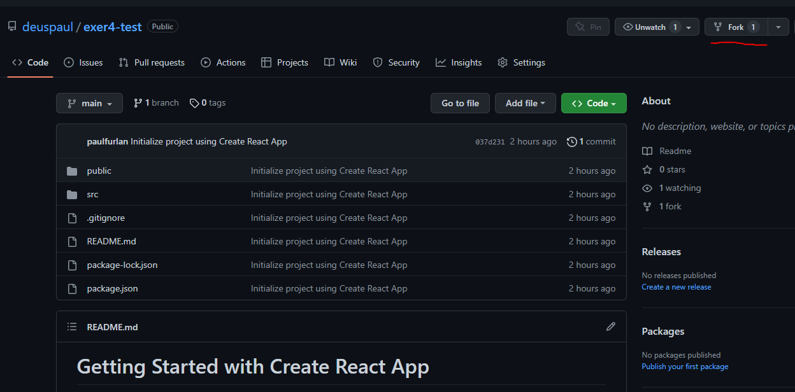

2)  Click on “Actions”, then click on “I understand my workflows, go
    ahead and enable them” and click on “new workflow” and then on “set
    up a workflow yourself”.\
    name this file “exercise4.yml” and add the following code:\
    name: buildfork\
    on:\
    workflow_dispatch:\
    \
    jobs:\
    build:\
    runs-on: ubuntu-latest\
    steps:\
    - uses: actions/checkout@v4

3)  In this workflow we will be building and testing our project. The
    first thing we will do is setup our cache to speed up this job in
    our workflow. To do so, add the following step to the code from the
    previous step.\
    \
    - name: Cache\
    uses: <actions/cache@v4.0.0>\
    with:\
    path: ~/.npm\
    key: buildCache\
    \
    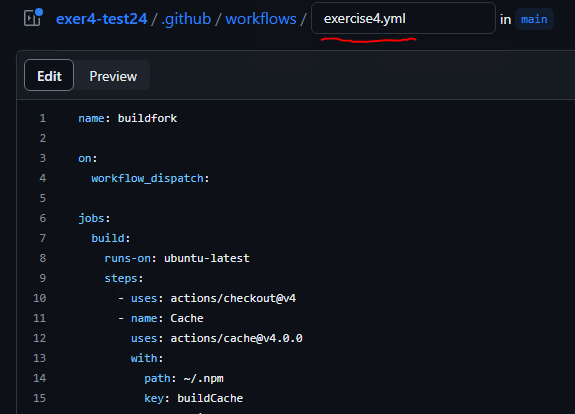

4)  Next we instruct it to install the packages it depends on based on
    the package-lock file in the repository. The difference here is that
    npm ci is used in automated environments such as CI pipelines.\
    \
    - run: npm ci

5)  Next we will use the included function to run unit tests. It already
    has a default single unit test defined in /src/App.test.js, which
    just tests that the text: “learn react” is in the page. We also run
    code coverage to get a report on the % of code covered by tests by
    adding -- --coverage. We also have to tell it that we are running
    this command in a workflow/pipeline, to do so, we set an environment
    variable named “CI” to “true”\
    \
    - run: npm test -- --coverage\
    env:\
    CI: true\
    \
    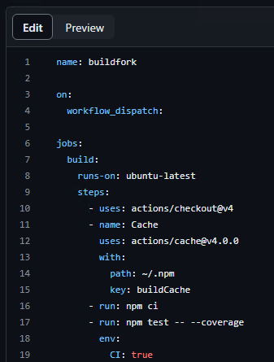

6)  Next, we will upload the artifacts generated by the tests so they
    can be reviewed outside of the pipeline. To do so, add the following
    block of code:\
    \
    - name: Upload code coverage\
    uses: <actions/upload-artifact@v4.3.1>\
    with:\
    name: codecoverage\
    path: coverage

7)  And finally, we will build our application with the “npm run build”
    command followed by an action to upload the build artifacts.\
    \
    - name: build\
    run: npm run build\
    - name: Upload build files\
    uses: <actions/upload-artifact@v4.3.1>\
    with:\
    name: build\
    path: build\
    \
    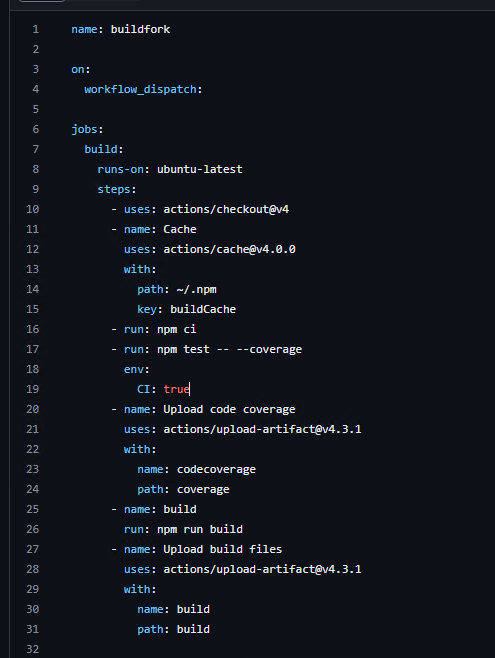

8)  Commit the changes and then head on over to actions and click on
    “run workflow” on main branch\
    \
    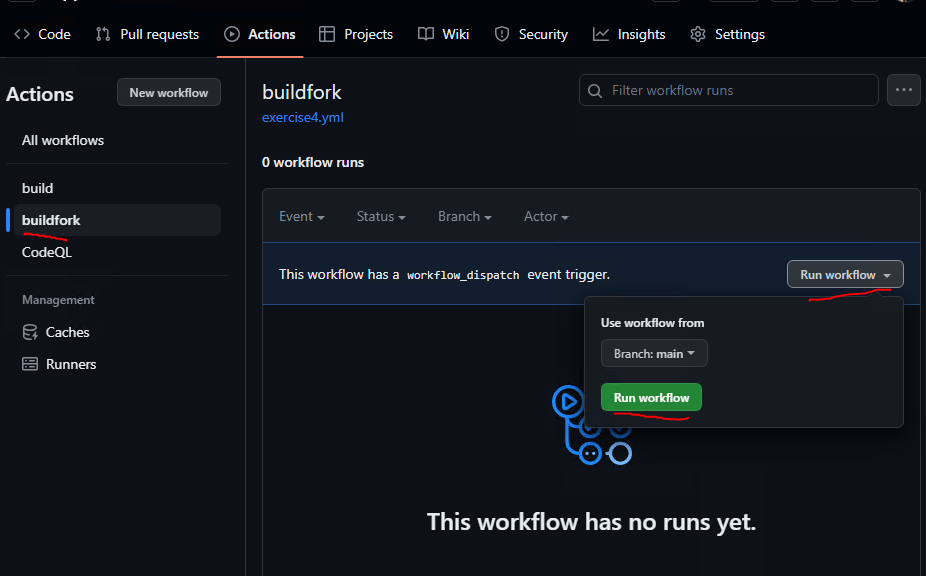

9)  In the summary page of the workflow you should be able to see the
    artifacts at the bottom:\
    \
    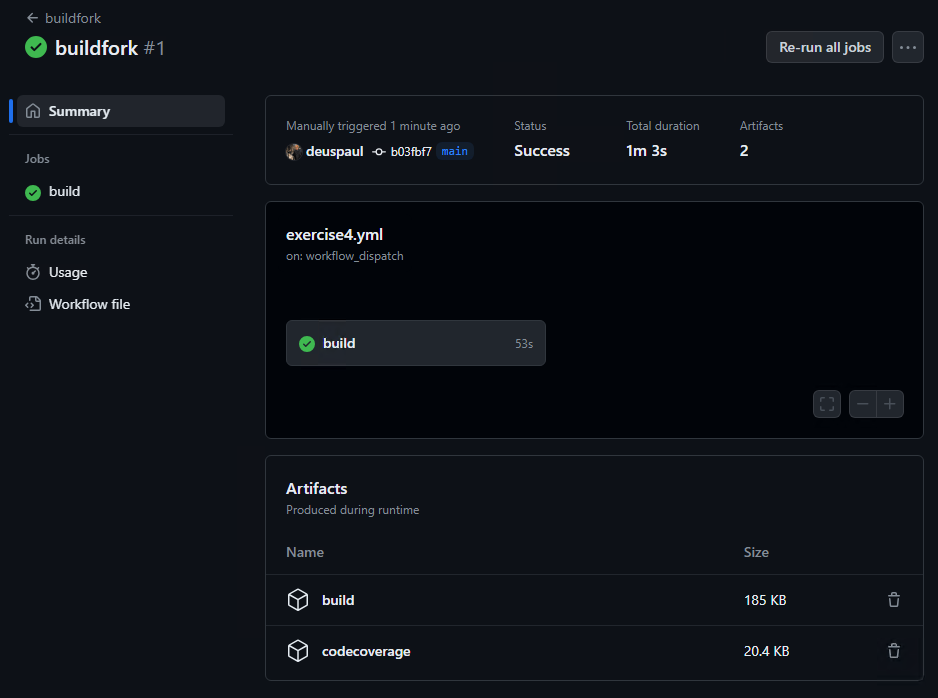

10) The contents of the build file should look like the following:

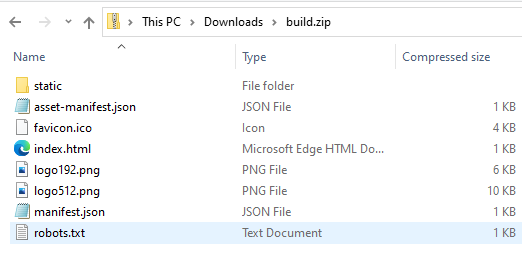

11) And the ones from code coverage should look like the following:\
    \
    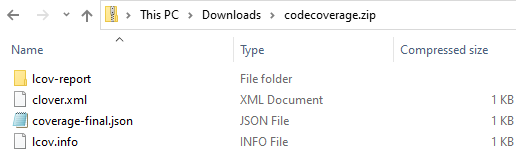

12) Upon clicking on the build job, you should notice the following:\
    \
    Since it is the first time we run this job, there will be no cache,
    so it will be created and saved:\
    \
    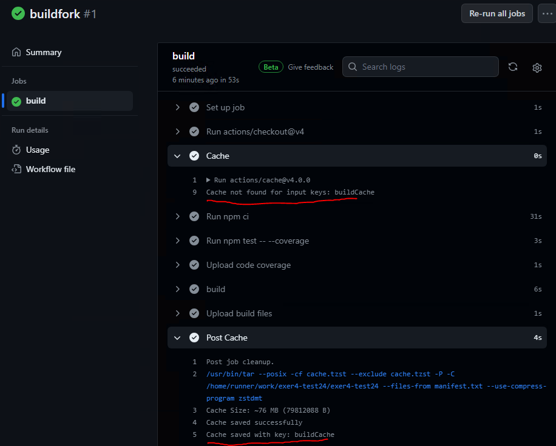\
    \
    And, the next time this job runs, it will restore the cache that was
    saved from a previous run:\
    \
    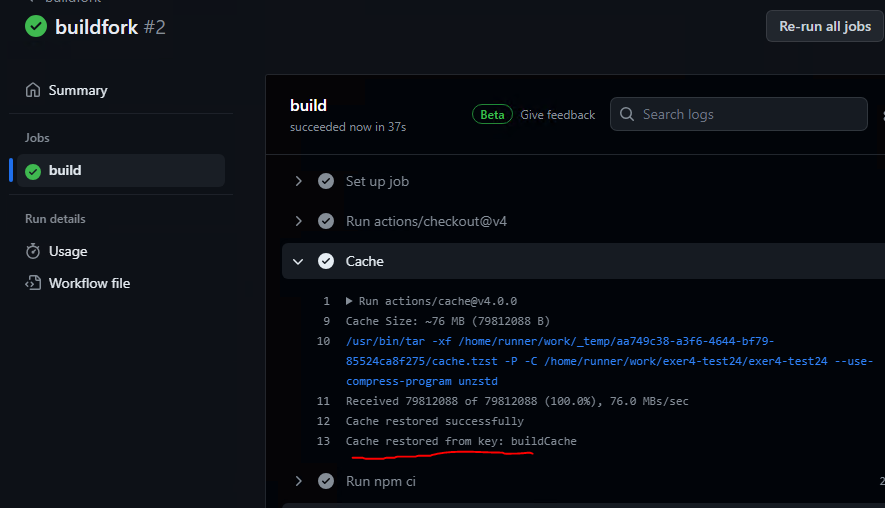

13) The report for the unit test and code coverage can be viewed in the
    pipeline job as well as in the artifacts where it can be viewed as a
    webpage:\
    \
    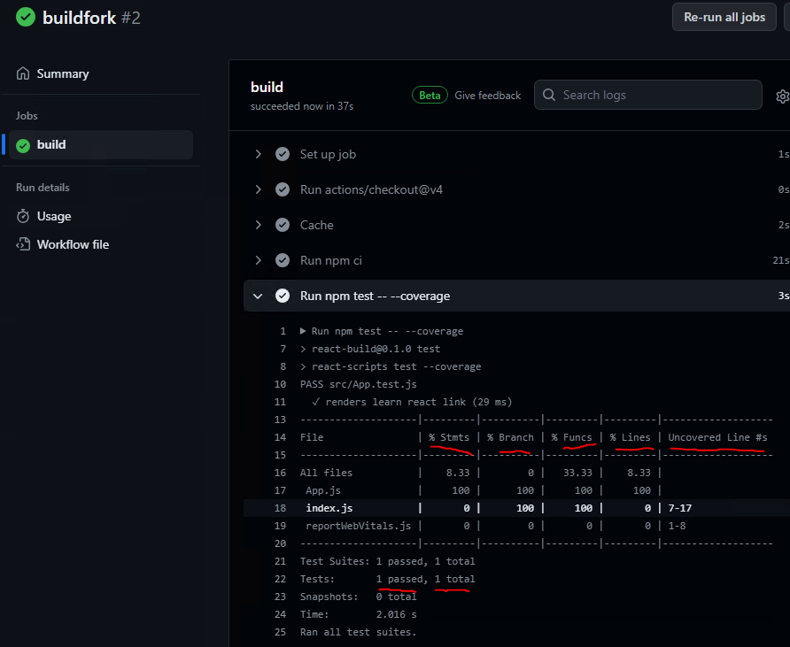

14) Next lets set up code scanning. Click on settings, then “code
    security and analysis” within the “security” section at the left.

15) Click on the “Set up” and select “Default” in the Code Scanning
    tools section.\
    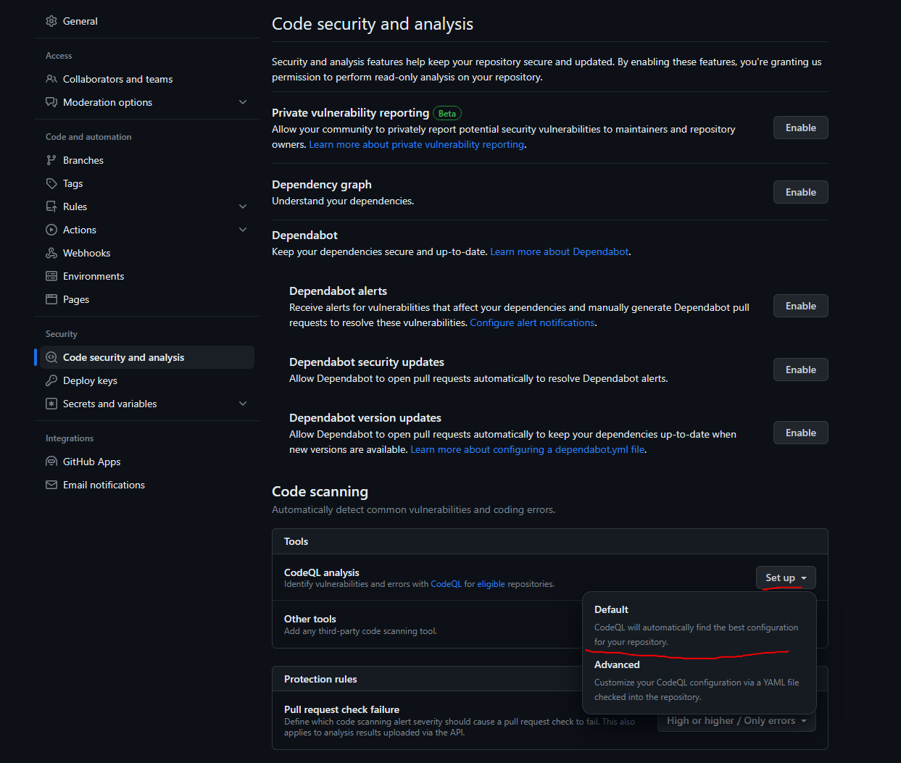

16) Then click on “Enable CodeQL”\
    \
    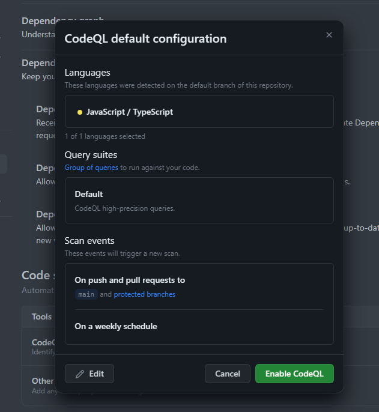

17) This will launch the CodeQL Setup workflow which you can find within
    Actions:\
    \
    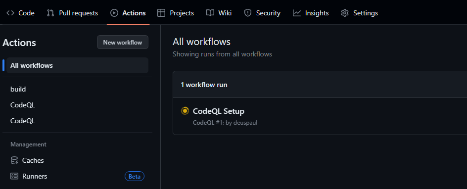

18) You can view details about the scan as it is running by expanding
    the “Perform CodeQL Analysis” step:\
    \
    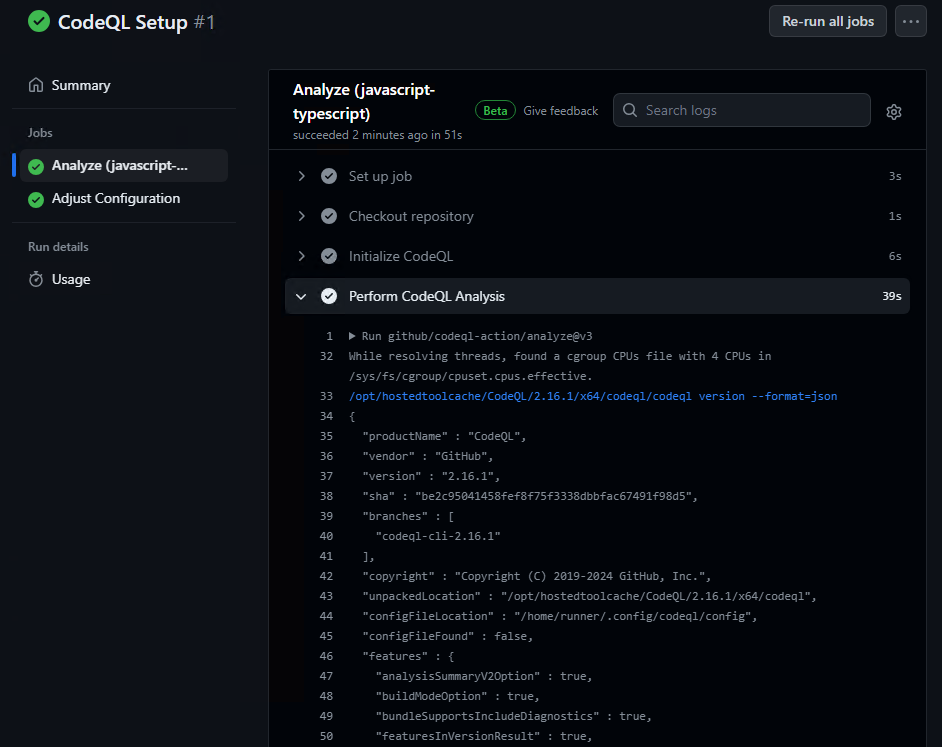

19) And you can view the status in the “Security” tab and then click on
    “Code scanning”\
    \
    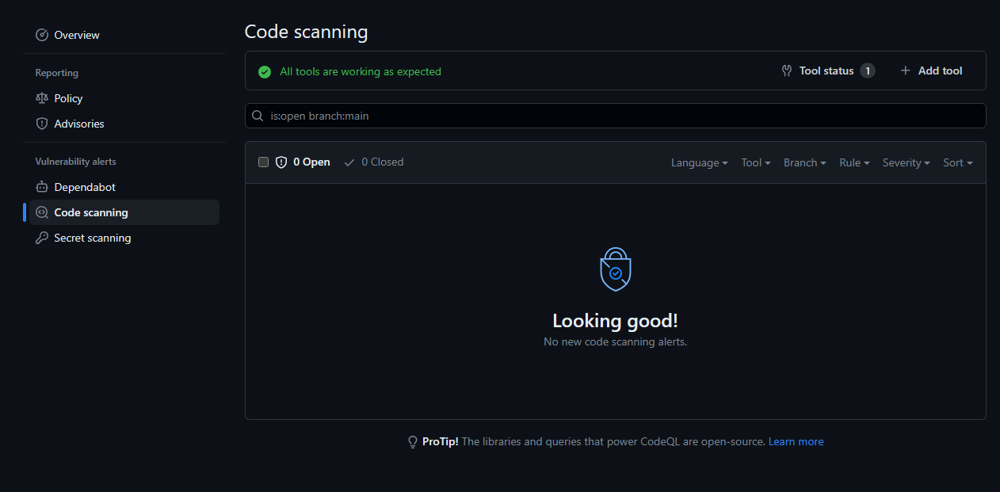

**Exercise \#5: Deploy** 

1)  Make sure you have NPM installed in your system, if you don’t have
    it installed follow the documentation:
    https://nodejs.org/en/download/

2)  Next open a terminal/powershell/cmd as administrator and install
    surge: npm install --global surge

3)  Next run: “surge” in terminal/powershell/cmd. If you get an error
    message about scripts being disabled in the system, run the
    following to bypass scripts for the process:\
    Set-ExecutionPolicy bypass -Scope Process

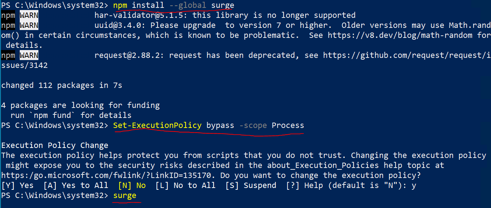

4)  It should ask you for your email, and to create a password.\
    You should receive an email to activate your account.\
    It should ask you for a project location, for this you can create a
    new folder or select an empty folder.\
    Then it should provide you with your url:\
    \
    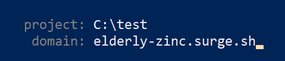

5)  Next generate a token with the command:\
    surge token

6)  Open the project from the previous exercise (the one we forked) and
    click on “settings”. Then within the “Code and automation” section
    click on “environments” and click on “New environment”. Name it
    “production” and do not add any protection rules.\
    \
    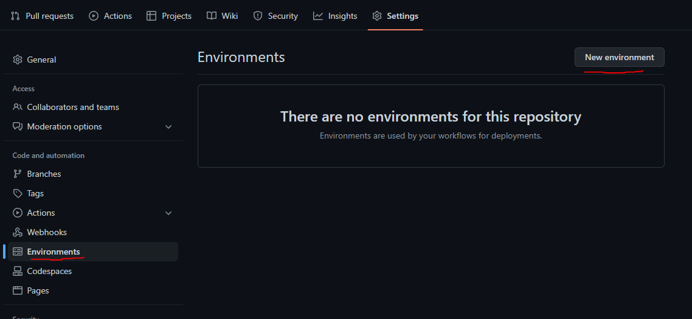

7)  Next, click on “Add Secret” within “Environment Secrets” and create
    the following:\
    SURGE_LOGIN (Input the email address for your surge account)\
    SURGE_TOKEN (paste the token that we copied on step \#5)\
    \
    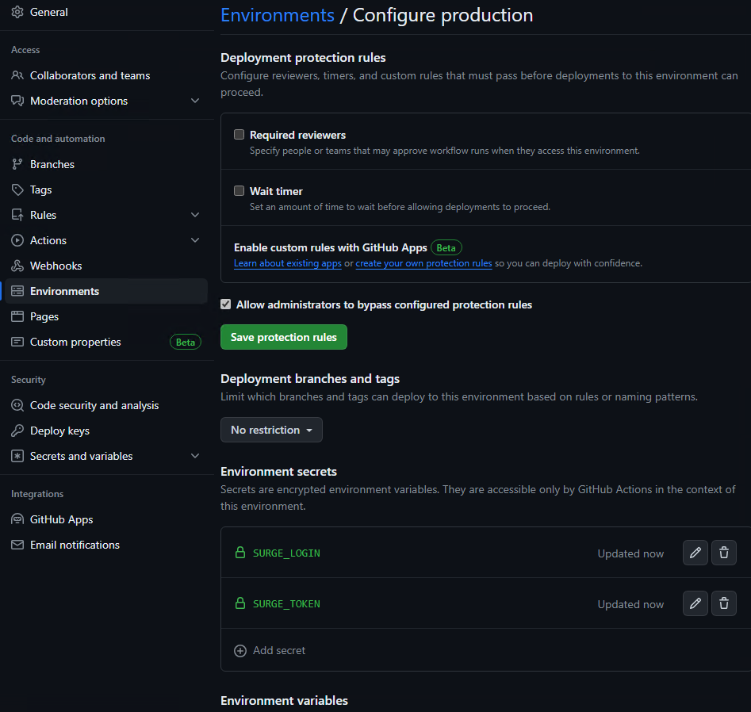

8)  Next let’s edit our workflow to deploy our application. Create a new
    job and add the following:\
    Replace the url with your url from surge (without the “\<” and “\>”
    symbols)\
    \
    deploy:\
    runs-on: ubuntu-latest\
    needs: build\
    environment:\
    name: production\
    url: http://\< replace-with-your-surge-url\>.surge.sh\
    \
    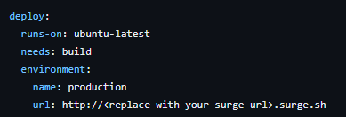

9)  Now we are ready to add the steps. Let’s download the build artifact
    from the “build” job.\
    \
    steps:\
    - name: Download the Build Artifact\
    uses: <actions/download-artifact@v4.1.2>\
    with:\
    name: build

10) Next, lets deploy our application. Add another step with the
    following code:\
    Replace the domain with your url from surge (without the “\<” and
    “\>” symbols)\
    \
    - name: deploy to surge\
    run: npx surge --project '.' --domain \<
    replace-with-your-surge-url\>.surge.sh\
    env:\
    SURGE_LOGIN: \${{ secrets.SURGE_LOGIN }}\
    SURGE_TOKEN: \${{ secrets.SURGE_TOKEN }}

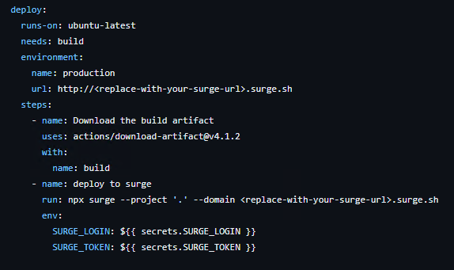

11) Change the trigger from “workflow_dispatch” to “push: branches:
    -main”\
    \
    on:\
    push:\
    branches:\
    - main

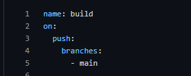

12) Click on “start commit” and commit directly to main branch

13) This will automatically trigger our workflow from now on every
    timewe make changes on the main branch\
    \
    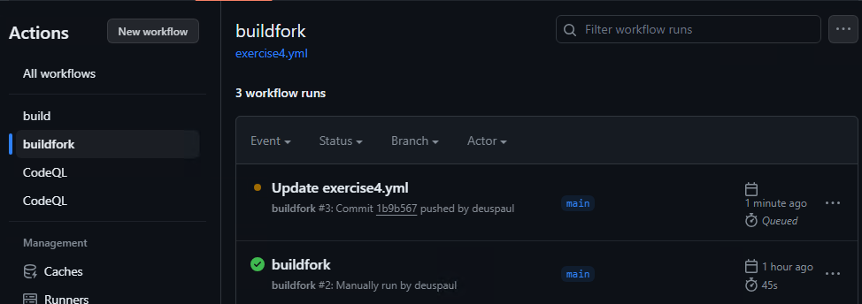

14) And once the job finishes successfully, you should see your
    environment url in the deploy job:\
    \
    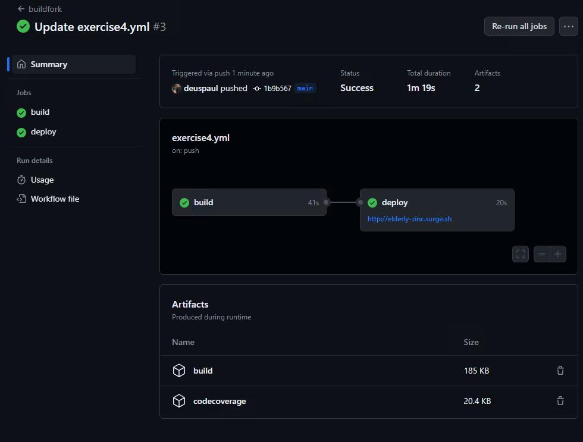\
    As well as in the main page of your repository:\
    \
    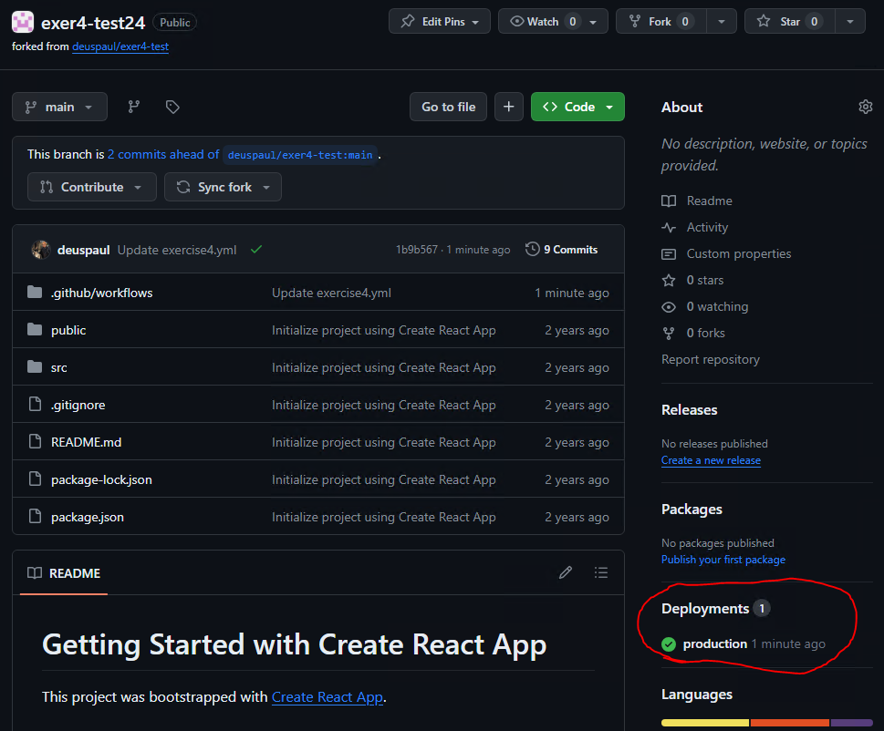
